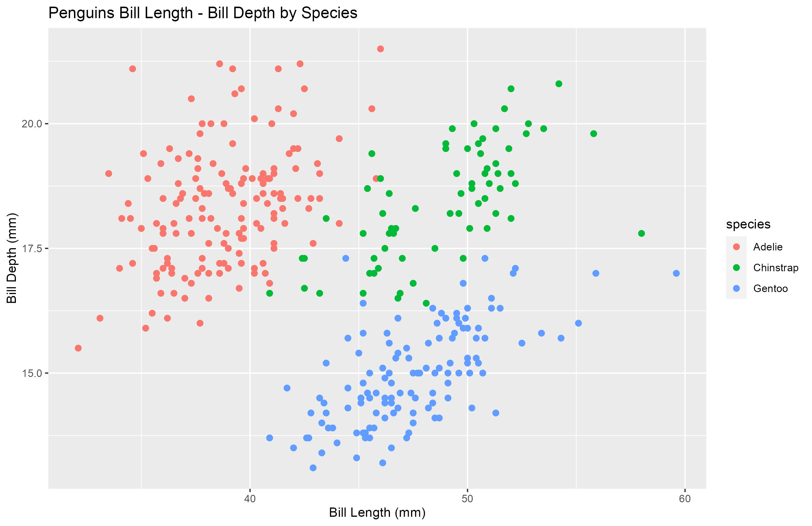

# Introduction

In this mini project for course BIOL520I Productivity and
Reproducibility in Ecology and Evolution, the *palmerpenguins* data
package was explored in R to understand the bill attributes of sampled
penguin species. Tables and figures were created in this process. No
in-depth analysis was conducted because the overall purpose of this mini
project is to simply demonstrate a reproducible workflow.

# Method

## Data

The dataset used in this project is accessed from R data pacakge
*palmerpenguins* [@Horst2020], originally published in @Gorman2014.

## Process

The dataset *penguins* was imported to dataframe from the data package.
A copy of the raw, unaltered data was saved as a CSV file. The dataframe
was then examined to understand the data structure completeness, where
observations with missing bill attributes were dropped for simplicity in
this demonstration. After cleaning up the data, I calculated simple
descriptive statistics for bill dimensions (*bill_length_mm* and
*bill_depth_mm* variables) and compared them across the three sampled
species. Tables and boxplots were created to show these differences in
bill dimensions. An additional histogram was created to show bill length
distribution within the species *"Adelie"*. Finally, a scatterplot of
bill dimensions was created across all three species with bill length on
the x-axis and bill depth on the y-axis to visualize any potential
correlation between the two variables. The scatter points were colored
by species to aid identification of specific clustering in the variable
space.

# Results

The bill lengths by species is summarized in Table \ref{billLen}

```{r billLen, echo = FALSE}
tbl_billLen <- read.csv(paste("../Data_3_Out", "bill_len_by_species.csv", sep = '/'))
knitr::kable(
    tbl_billLen,
    caption = "\\label{billLen}Bill Length by Species"
)
```

The bill dimensions scatterplot (Figure \ref{scatter}) shows a visually
detectable positive correlation between *bill_length_mm* and
*bill_depth_mm* within species. There is specific clustering in the
variable space.

```{r label=scatter, fig.align='center', out.width="100%", fig.cap = "\\label{scatter}Scatterplot of Bill Length vs Bill Depth", echo = FALSE}

```

# Discussion

I have found a qualitatively positive correlation between bill length
and bill depth in all three sampled penguin species. This correlation
can be quantified using regression methods in future studies.

The bill attribute observations show a tendency of clustering by species
in the bill dimension variable space. This suggests differences in bill
sizes and shape characteristics across the three species. Further research on these characteristics may lead to quantitative methods to identify sample species using bill dimension measurements.
\pagebreak
# References {.unnumbered}
